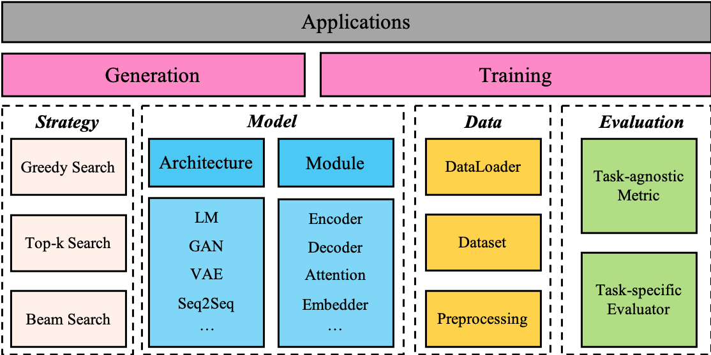

---

# TextBox 2.0 (妙笔)

*“李太白少时，梦所用之笔头上生花后天才赡逸，名闻天下。”——王仁裕《开元天宝遗事·梦笔头生花》*

TextBox 2.0 is an up-to-date text generation library based on Python and PyTorch focusing on building a unified and standardized pipeline for applying Pre-trained language models to text generation:

- From a **task** perspective, we consider 13 common text generation tasks such as translation, story generation and style transfer, and their corresponding 83 widely-used datasets. 
- From a **model** perspective, we incorporate 36 PLMs covering the categories of general, translation, dialogue, controllable, distilled, Chinese, and light-weight PLMs.
- From a **training** perspective, we support 4 pre-training objectives and 4 efficient and robust training strategies, such as distributed data parallel and efficient generation.


Compared with previous version of TextBox, this extension mainly focuses on building a unified, flexible and standardized framework for better supporting PLM-based text generation models. There are three advantages in TextBox 2.0:

- It is a significant innovation focusing on comprehensive tasks and PLMs.
- It is designed to be unified in implementation and interface.
- It produces very similar performance with original or official implementations.

<p align="center">
  
  <br>
  The Overall Framework of TextBox 2.0
</p>

<!-- ===================== Installation ===================== -->

## Installation

```bash
git clone https://github.com/RUCAIBox/TextBox.git && cd TextBox
bash install.sh
```

### W&B Dashboard Configuration

Weights&Biases dashboard is intergrated. For the first run, follow the prompt to register an account and log in with [API key](https://wandb.ai/authorize). See [advanced configuration](#wb-dashboard-advanced-configuration) for more information.

<!-- ===================== Quick Start ===================== -->

## Quick Start

The script below will run the facebook `BART-base` model on the `samsum` dataset. The yielded files mainly include a log file like [example.log](asset/example.log) in `log` and checkpoint files in `saved`. See [Model Parameters](#model-parameters) for more detail of `model_path`.

```bash
python run_textbox.py --model_path=facebook/bart-base
```

### Specify Model and Dataset

Substitute `<xxx>` with your choices. See [Model](#Model), [Dataset](#Dataset) for a full support list.

```bash
python run_textbox.py --model=<model-name> --dataset=<dataset-name> --model_path=<hf-or-local-path> ...
# Example (equivalent of default configuration):
python run_textbox.py --model=BART --dataset=samsum --model_path=facebook/bart-base
```

### Load from Config Files

You may also want to load your own configurations in the local files:

```bash
python run_textbox.py ... --config_files <config-file-one> <config-file-two>
```

### Partial Experiment

You can run partial experiment with `do_train`, `do_valid`, `do_test`. Yan test your pipeline and debug with `quick_test=<amount-of-data-to-load>` to load just a few examples. In some cases, `load_experiment=<path-to-checkpoint>` is needed to load model beforehand.

The following script loads the trained model `example.pth` and conducts generation and evaluation.
```bash
python run_textbox.py ... --do_train=False --load_experiment=example.pth --quick_test=16
```

<!-- ===================== Training ===================== -->

## Training

### Basics

You can choose optimizer and scheduler through `optimizer=<optimizer-name>` and `scheduler=<scheduler-name>`. We provide a wrapper around **pytorch optimizer**, which means parameters like `epsilon` or `warmup_steps` can be specified with keyword dictionaries `optimizer_kwargs={'epsilon': ... }` and `scheduler_kwargs={'warmup_steps': ... }`. See [pytorch optimizer](https://pytorch.org/docs/stable/optim.html#algorithms) and [scheduler]() for a complete tutorial.  <!-- TODO -->

Validation frequency is introduced to validate the model **at each specific batch-steps or epochs**. Specify `valid_strategy` (either `'step'` or `'epoch'`) and `valid_intervals=<int>` to adjust the pace. Specifically, traditional train-validate paradigm is a special case with `valid_strategy=epoch` and `valid_intervals=1`.

`max_save=<int>` indicates **the maximal amount of saved files** (checkpoint and generated corpus during evaluation). `-1`: save every file, `0`: do not save any file, `1`: only save the file with best score, and `n`: save both the best and the last $n−1$ files.

Evaluation metrics can be specified with `metrics` ([full list](#Evaluation)), and produce a dictionaries of results:

```bash
python run_textbox.py ... --metrics=\[\'rouge\'\]
# results: { 'rouge-1': xxx, 'rouge-2': xxx, 'rouge-l': xxx, 'rouge-w': xxx, ... }
```

**Early stopping** can be configured with `metrics_for_best_model=<list-of-metrics-entries>`, which is used to calculate score, and `stopping_steps=<int>`, which specifies the amount of validation steps:

```bash
python run_textbox.py ... --stopping_steps=8 --metrics_for_best_model=\[\'rouge-1\', \'rouge-w\'\]
```

or yaml equivalent:

```yaml
stopping_steps: 8
metrics_for_best_model: ['rouge-1', 'rouge-w']
```

Other commonly used parameters includes `epochs=<int>` and `max_steps=<int>` (indicating maximum iteration of epochs and batch steps), `learning_rate=<float>`, `train_batch_size=<int>`, `weight_decay=<bool>`, and `grad_clip=<bool>`.

### Pre-trained Model Parameters

`model_path` receives a name of model on [huggingface](https://huggingface.co/models) like [`facebook/bart-base`](https://huggingface.co/models?search=facebook%2Fbart-base) or just a local path.

Not only `model_path`, but `config_path` and `tokenizer_path` (same value with `model_path` by default) also receive a huggingface model or a local path. Besides, `config_kwargs` and `tokenizer_kwargs` are useful when additional parameters are required.

For example, when building a *Task-oriented Dialogue System*, special tokens can be added with `additional_special_tokens`; fast tokenization can also be switched with `use_fast`:

```yaml
config_kwargs: {}
tokenizer_kwargs: { 'use_fast': False, 'additional_special_tokens': ['[db_0]', '[db_1]', '[db_2]'] }
```

Other commonly used parameters includes `label_smoothing`

```yaml
label_smoothing: <smooth-loss-weight>
```

The full keyword arguments should be found in [PreTrainedTokenizer](https://huggingface.co/docs/transformers/v4.21.0/en/main_classes/tokenizer#transformers.PreTrainedTokenizer) or documents of corresponding tokenizer.

### Generation Parameters

Pre-trained model is able to perform generation using various methods by combining different [parameters](https://huggingface.co/docs/transformers/main/en/main_classes/text_generation#transformers.generation_utils.GenerationMixin.generate). By default, beam search is adapted:

```yaml
generation_kwargs: {'num_beams': 5, 'early_stopping': True}
```

Nucleus sampling is also supported by pre-trained model:

```yaml
generation_kwargs: {'do_sample': True, 'top_k': 10, 'top_p': 0.9}
```

### Dataset Parameters

`src_len`, `tgt_len`, and `truncate` restricts the maximal length of source/target sentence and the positional to be truncated (`head` or `tail`). For some models used for translation task like m2m100, you need to specify source language and target language:

```yaml
# m2m100: en -> zh
src_lang: 'en'
tgt_lang: 'zh'
```

### Evaluation Parameters

After specifying several evaluation metrics, further configuration on them is as follows:

For example, `rouge` provides `rouge_max_ngrams` and `rouge_type` to specify the maximal number of ngrams and type of rouge (like `files2rouge`, `rouge-score`, etc.). In addition, `bleu` provides `bleu_max_ngrams`, `bleu_type`, `smoothing_function=<int>`, and `corpus_bleu=<bool>` to customize metric.

```yaml
bleu_max_ngrams: 4
bleu_type: nltk
smoothing_function: 0
corpus_bleu: False

distinct_max_ngrams: 4
```

Other evaluation metrics ([full list](#Evaluation)) observe the same naming rules.

### Prompting

To prompt at `prefix` or `suffix`, pass strings to the following parameters:

```yaml
prefix_prompt: 'Summarize: '
suffix_prompt: ' (Write a story)'
```

#### Parameter-efficient Prompting

Besides human instruction, parameter-efficient prompting is also supported，though only for `BART`, `T5`, and `GPT-2` model, with methods including `lora`, `prefix-tuning` (equivalent to `p-tuning-v2`), `adapter`, and `prompt-tuning`:

```yaml
efficient_methods: ['adapter', 'prompt-tuning']
```

To further modify the prompting methods, use `efficient_unfreeze_model` and `efficient_kwargs` by finding parameters for corresponding methods in [docs]() and put them together in keyword arguments:  <!-- TODO -->

```yaml
efficient_kwargs: { 'adapter_mid_dim': <int>, 'prompt_length': <int> }
efficient_unfreeze_model: <bool>
```

### Pre-training

Pre-training models from scratch or continue pre-training from existing checkpoints is essential to achieving SOTA results. We support modularized pre-training tasks as individual collate functions to meet flexible pre-training demands. 

Currently, we support pre-training tasks from BART paper, including Text Infilling and Sentence Permutation (which is sufficient to reproduce BART results from the original paper according to this [Github Issue](https://github.com/facebookresearch/fairseq/issues/1899#issuecomment-1069429320) from BART author).

To enable pre-training, simply set `--pretrain_task` to `denoising` or `text_infilling`(by default, pre-training is disabled and thus set to `disabled`). We plan to add more pre-training tasks at `textbox/data/utils.py`.

```bash
python run_textbox.py ... --pretrain_task=<task-name>
```

+ Experimental Tasks from BART (Token Deletion, Document Rotation)
+ Language Model
+ Masked Language Model (separate from Token Masking in BART)
+ Permuted Language Model

### Efficient Training

#### Multi-GPU Training & FP16

TextBox supports to train models with multiple GPUs and FP16 method based on `accelerate`. Configurate and test (not always necessary) [accelerate](https://github.com/huggingface/accelerate) with `accelerate config` and `accelerate test` in shell ([example](asset/accelerate.md)). 

Once running `accelerate config`, you can run code in the same configuration without setting config again. If you want to change the configuration of `accelerate`, just re-run `accelerate config` to reset the configuration. If you don't want to use `accelerate`, run code using `python` command as .

To accelerate multi-gpu training with `accelerate`, run the script below. Note that the main process of `accelerate` listen to port `main_process_port`. If you run multiple TextBox instances on a single machine with FSDP (Fully Sharded Data Parallel) enabled, please manually set to a different port.

```bash
accelerate launch [--main_process_port <port-number>] run_textbox.py ...
```

In multi-GPU training, you should set the hyper-parameter `gpu_id` to decide the devices in training. And the number of GPUs set in `gpu_id` is necessary greater or equal to the number of GPUs set in `accelerate`. 

```bash
accelerate launch [--main_process_port <port-number>] \
        run_textbox.py ... --gpu_id=<gpu-ids>
```

Note that `gpu_ids` is the usable GPU id list (such as `0,1,2,3`).

### Hyper-Parameters Tuning

```bash
python run_hyper.py --space=textbox/properties/hyperopt_example.test --algo='exhaustive'  --model_path=facebook/bart-base --metrics=\[\'rouge\'\] --metrics_for_best_model=\[\'ROUGE-1\'\]
```

A separate script `run_hyper.py` is provided for hyper-parameters tuning. Use `space=<path-to-space-file>` and `algo=<algo-name>` to select from different configurations ([tutorial](asset/hyper_tuning.md)).

### Multiple Random Seeds

Similar to hyper-parameters tuning, another python code with new parameter `multi_seed=<int>` indicating the amount of seeds to be tested, is introduced for multiple random seeds test:

```bash
python run_multi_seed.py --multi_seed=16  --model_path=facebook/bart-base --metrics=\[\'rouge\''\] --metrics_for_best_model=\[\'ROUGE-1\'\]
```

Specify `seed` parameter to reproduce generation of multiple seeds.

### W&B Dashboard Advanced Configuration

If you are running your code in jupyter environments, you may want to login by simply setting an environment variable (your key may be stored in plain text):

```python
%env WANDB_API_KEY=<your-key>
```

If you are debugging your model, you may want to **disable W&B** with `wandb disabled` in the command line and **none of the metrics** will be recorded. To re-enable it, use `wandb enabled`.

You can also disable **sync only** with `wandb offline` and enable it again with `wandb online`. The local files can be uploaded by executing `wandb sync`.

After configuration, you can throttle wandb prompts by defining environment variable `export WANDB_SILENT=false`. For more information, see [documentation](docs.wandb.ai).


<!-- ===================== Model ===================== -->


## Model

<!-- Thanks for table generatros https://www.tablesgenerator.com/html_tables -->


<div class="tg-wrap"><table align="center">
<thead>
  <tr>
    <th align="center" colspan="2">Category</th>
    <th align="center">Model Name</th>
    <th align="center">Reference</th>
  </tr>
</thead>
<tbody>
  <tr>
    <td rowspan="15" align="center"><strong>General</strong></td>
    <td rowspan="4" align="center"><strong>CLM</strong></td>
    <td align="center">OpenAI-GPT</td>
    <td align="center"><a href="https://cdn.openai.com/research-covers/language-unsupervised/language_understanding_paper.pdf">(Radford et al., 2018)</a></td>
  </tr>
  <tr>
    <td align="center">GPT2</td>
    <td align="center"><a href="https://cdn.openai.com/better-language-models/language_models_are_unsupervised_multitask_learners.pdf">(Radford et al., 2019)</a></td>
  </tr>
  <tr>
    <td align="center">GPT_Neo</td>
    <td align="center"><a href="https://arxiv.org/pdf/2101.00027">(Gao et al., 2021)</a></td>
  </tr>
  <tr>
    <td align="center">OPT</td>
    <td align="center"><a href="https://arxiv.org/pdf/2205.01068">(Artetxe et al., 2022)</a></td>
  </tr>
  <tr>
    <td rowspan="11" align="center"><strong>Seq2Seq</strong></td>
    <td align="center">BART</td>
    <td align="center"><a href="https://arxiv.org/pdf/1910.13461">(Lewis et al., 2020)</a></td>
  </tr>
  <tr>
    <td align="center">T5</td>
    <td align="center"><a href="https://arxiv.org/pdf/1910.10683">(Raffel et al., 2020)</a></td>
  </tr>
  <tr>
    <td align="center">UniLM</td>
    <td align="center"><a href="https://arxiv.org/pdf/1905.03197">(Dong et al., 2019)</a></td>
  </tr>
  <tr>
    <td align="center">MASS</td>
    <td align="center"><a href="https://arxiv.org/pdf/1905.02450">(Song et al., 2019)</a></td>
  </tr>
  <tr>
    <td align="center">Pegasus</td>
    <td align="center"><a href="https://arxiv.org/pdf/1912.08777">(Zhang et al., 2019)</a></td>
  </tr>
  <tr>
    <td align="center">ProphetNet</td>
    <td align="center"><a href="https://arxiv.org/pdf/2001.04063">(Qi et al., 2020)</a></td>
  </tr>
  <tr>
    <td align="center">MVP</td>
    <td align="center"><a href="https://arxiv.org/pdf/2206.12131">(Tang et al., 2022)</a></td>
  </tr>
  <tr>
    <td align="center">BERT2BERT</td>
    <td align="center"><a href="https://aclanthology.org/2020.tacl-1.18.pdf">(Rothe et al., 2020)</a></td>
  </tr>
  <tr>
    <td align="center">BigBird-Pegasus</td>
    <td align="center"><a href="https://arxiv.org/pdf/2007.14062">(Zaheer et al., 2020)</a></td>
  </tr>
  <tr>
    <td align="center">LED</td>
    <td align="center"><a href="https://arxiv.org/pdf/2004.05150">(Beltagy et al., 2020)</a></td>
  </tr>
  <tr>
    <td align="center">LongT5</td>
    <td align="center"><a href="https://arxiv.org/pdf/2112.07916">(Guo et al., 2021)</a></td>
  </tr>


  <tr>
    <td rowspan="8" colspan="2" align="center"><strong>Multilingual Models</strong></td>
    <td align="center">mBART</td>
    <td align="center"><a href="https://arxiv.org/pdf/2001.08210">(Liu et al., 2020)</a></td>
  </tr>
  <tr>
    <td align="center">mT5</td>
    <td align="center"><a href="https://arxiv.org/pdf/2010.11934">(Xue et al., 2020)</a></td>
  </tr>
  <tr>
    <td align="center">Marian</td>
    <td align="center"><a href="https://aclanthology.org/2020.eamt-1.61.pdf">(Tiedemann et al., 2020)</a></td>
  </tr>
  <tr>
    <td align="center">M2M_100</td>
    <td align="center"><a href="https://arxiv.org/pdf/2010.11125">(Fan et al., 2020)</a></td>
  </tr>
  <tr>
    <td align="center">NLLB</td>
    <td align="center"><a href="https://arxiv.org/ftp/arxiv/papers/2207/2207.04672.pdf">(NLLB Team, 2022)</a></td>
  </tr>
  <tr>
    <td align="center">XLM</td>
    <td align="center"><a href="https://arxiv.org/pdf/1901.07291">(Lample et al., 2019)</a></td>
  </tr>
  <tr>
    <td align="center">XLM-RoBERTa</td>
    <td align="center"><a href="https://arxiv.org/pdf/1911.02116">(Conneau et al., 2019)</a></td>
  </tr>
  <tr>
    <td align="center">XLM-ProphetNet</td>
    <td align="center"><a href="https://arxiv.org/pdf/2001.04063">(Qi et al., 2020)</a></td>
  </tr>


  <tr>
  <td rowspan="6" colspan="2" align="center"><strong>Chinese Models</strong></td>
    <td align="center">CPM</td>
    <td align="center"><a href="https://arxiv.org/pdf/2012.00413">(Zhang et al., 2020)</a></td>
  </tr>
  <tr>
    <td align="center">CPT</td>
    <td align="center" rowspan="2"><a href="https://arxiv.org/pdf/2109.05729">(Shao et al., 2021)</a></td>
  </tr>
  <tr>
    <td align="center">Chinese-BART</td>
  </tr>
  <tr>
    <td align="center">Chinese-GPT2</td>
    <td align="center" rowspan="3"><a href="https://arxiv.org/pdf/1909.05658">(Zhao et al., 2019)</a></td>
  </tr>
  <tr>
    <td align="center">Chinese-T5</td>
  </tr>
  <tr>
    <td align="center">Chinese-Pegasus</td>
  </tr>


  <tr>
    <td rowspan="3" colspan="2" align="center"><strong>Dialogue Models</strong></td>
    <td align="center">Blenderbot</td>
    <td align="center" rowspan="2"><a href="https://arxiv.org/pdf/2004.13637">(Roller et al., 2020)</a></td>
  </tr>
  <tr>
    <td align="center">Blenderbot-Small</td>
  </tr>
  <tr>
    <td align="center">DialoGPT</td>
    <td align="center"><a href="https://arxiv.org/pdf/1911.00536">(Zhang et al., 2019)</a></td>
  </tr>


  <tr>
    <td rowspan="2" colspan="2" align="center"><strong>Conditional Models</strong></td>
    <td align="center">CTRL</td>
    <td align="center"><a href="https://arxiv.org/pdf/1909.05858">(Keskar et al., 2019)</a></td>
  </tr>
  <tr>
    <td align="center">PPLM</td>
    <td align="center"><a href="https://arxiv.org/pdf/1912.02164">(Dathathri et al., 2019)</a></td>
  </tr>

  <tr>
    <td rowspan="2" colspan="2" align="center"><strong>Distilled Models</strong></td>
    <td align="center">DistilGPT2</td>
    <td align="center"><a href="https://arxiv.org/pdf/1910.01108">(Sanh et al., 2019)</a></td>
  </tr>
  <tr>
    <td align="center">DistilBART</td>
    <td align="center"><a href="https://arxiv.org/pdf/2010.13002">(Shleifer et al., 2020)</a></td>
  </tr>
</tbody>
</table></div>


<!-- ===================== Dataset ===================== -->


## Dataset

Now we support 13 generation tasks and corresponding datasets (the item in the bracket is the name used in `--dataset`):
- Text summarization: CNN/Daily Mail (cnndm), XSum (xsum), SAMSum (samsum), WLE (wle), Newsroom (nr), WikiHow (wikihow), MicroSoft News (msn), MediaSum (mediasum), and English Gigaword (eg).
- Machine Translation: WMT14 English-French (wmt14-fr-en), WMT16 Romanian-English (wmt16-ro-en), WMT16 German-English (wmt16-de-en), WMT19 Czech-English (wmt19-cs-en), WMT13 Spanish-English (wmt13-es-en), WMT19 Chinese-English (wmt19-zh-en), and WMT19 Russian-English (wmt19-ru-en).
- Open-ended dialogue system: PersonaChat (pc), DailyDialog (dd), DSTC7-AVSD (da), SGD (sgd), Topical-Chat (tc), Wizard of Wikipedia (wow), Movie Dialog (md), Cleaned OpenSubtitles Dialogs (cos), Empathetic Dialogues (ed), Curiosity (curio), CMU Document Grounded Conversations (cmudog), MuTual (mutual), OpenDialKG (odkg), and DREAM (dream).
- Data-to-text generation: WebNLG v2.1 (webnlg), WebNLG v3.0 (webnlg2), WikiBio (wikibio), E2E (e2e), DART (dart), ToTTo (totto), ENT-DESC (ent), AGENDA (agenda), GenWiki (genwiki), TEKGEN (tekgen), LogicNLG (logicnlg), WikiTableT (wikit), and WEATHERGOV (wg).
- Question generation: SQuAD (squadqg), CoQA (coqaqg), NewsQA (newsqa), HotpotQA (hotpotqa), MS MARCO (marco), MSQG (msqg), NarrativeQA (nqa), and QuAC (quac).
- Story generation: ROCStories (roc), WritingPrompts (wp), Hippocorpus (hc), WikiPlots (wikip), and ChangeMyView (cmv).
- Question answering: SQuAD (squad), CoQA (coqa), Natural Questions (nq), TriviaQA (tqa), WebQuestions (webq), NarrativeQA (nqa), MS MARCO (marco), NewsQA (newsqa), HotpotQA (hotpotqa), MSQG (msqg), and QuAC (quac).
- Task-oriented dialogue system: MultiWOZ 2.0 (multiwoz), MetaLWOZ (metalwoz), KVRET (kvret), WOZ (woz), CamRest676 (camres676), Frames (frames), TaskMaster (taskmaster), Schema-Guided (schema), and MSR-E2E (e2e_msr).
- Chinese generation: LCSTS (lcsts), CSL (csl), and ADGEN (adgen).
- Commonsense generation: CommonGen (cg).
- Paraphrase generation: Quora (quora) and ParaNMT-small (paranmt).
- Text style transfer: GYAFC-E&M and F&R (gyafc-em, gyafc-fr).
- Text simplification: WikiAuto + Turk/ASSET (wia-t).

These datasets can be downloaded at [https://huggingface.co/RUCAIBox](https://huggingface.co/RUCAIBox). The leaderboard of each dataset can be found in [our respository](Leaderboard).

We also support you to run our model using your own dataset. Just follow the three steps:

1. Create a new folder under the `dataset` folder to put your own corpus file which includes a sequence per line, e.g. `dataset/YOUR_DATASET`;
2. Write a YAML configuration file using the same file name to set the hyper-parameters of your dataset, e.g. `textbox/properties/dataset/YOUR_DATASET.yaml`.


<!-- ===================== Evaluation ===================== -->

## Evaluation

15 mainstream evaluation metrics are intergrated:

<div class="tg-wrap"><table>
<thead>
  <tr>
    <th colspan="5" align="center">Evaluation</th>
  </tr>
</thead>
<tbody>
  <tr>
    <td align="center">bert_score</td>
    <td align="center">bleu</td>
    <td align="center">chrf</td>
    <td align="center">chrf+</td>
    <td align="center">chrf++</td>
  </tr>
  <tr>
    <td align="center">cider</td>
    <td align="center">distinct</td>
    <td align="center">meteor</td>
    <td align="center">nist</td>
    <td align="center">qa</td>
  </tr>
  <tr>
    <td align="center">rouge</td>
    <td align="center">self_bleu</td>
    <td align="center">spice</td>
    <td align="center">ter</td>
    <td align="center">unique</td>
  </tr>
</tbody>
</table></div>


> **Warning**
> Backslashes and no-extra-space are required when inputting a list of string like `\[\'bleu\',\'rouge\'\]` in command line. As a result, a preset run configuration is more recommended.


## Releases

<!-- TODO -->

| Releases |    Date    |    Features   |
| :------: | :--------: | :-----------: |
|  v2.0.0  | 20/08/2022 |    TextBox    |
|  v0.2.1  | 15/04/2021 |    TextBox    |
|  v0.1.5  | 01/11/2021 | Basic TextBox |

## Contributing

Please let us know if you encounter a bug or have any suggestions by [filing an issue](https://github.com/RUCAIBox/TextBox/issues).

We welcome all contributions from bug fixes to new features and extensions.

We expect all contributions discussed in the issue tracker and going through PRs.

We thank [@LucasTsui0725](https://github.com/LucasTsui0725/) for contributing HRED model and [@Richar-Du](https://github.com/Richar-Du/) for CVAE model.

We thank [@wxDai](https://github.com/Dai-Wenxun) for contributing PointerNet and more than 20 language models in transformers API.

We thank [@sbrodeur](https://github.com/sbrodeur) for [code](https://github.com/hyperopt/hyperopt/issues/200#issuecomment-507287308) of exhaustive search for hyper tuning.  <!-- TODO -->

## Reference

If you find TextBox useful for your research or development, please cite the following [paper](https://arxiv.org/abs/2101.02046):

```
@article{textbox,
    title={TextBox: A Unified, Modularized, and Extensible Framework for Text Generation},
    author={Junyi Li, Tianyi Tang, Gaole He, Jinhao Jiang, Xiaoxuan Hu, Puzhao Xie, Wayne Xin Zhao, Ji-Rong Wen},
    year={2021},
    journal={arXiv preprint arXiv:2101.02046}
}
```

## The Team

TextBox is developed and maintained by [AI Box](http://aibox.ruc.edu.cn/).

## License

TextBox uses [MIT License](./LICENSE).

