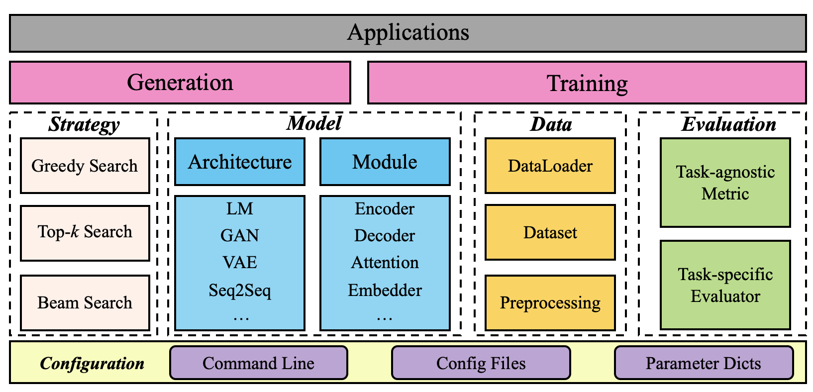

------

# TextBox (文骏)

[](https://pypi.org/project/textbox/) [](./LICENSE)

[Docs] | [Model] | [Dataset] | [Paper]

[Docs]: https://rucaibox.github.io/textbox.github.io/
[Model]: #Model
[Dataset]: #Dataset
[Paper]: https://arxiv.org/abs/2011.01731

TextBox is developed based on Python and PyTorch for reproducing and developing text generation algorithms in a unified, comprehensive and efficient framework for research purpose. Our library includes 16 text generation algorithms, covering two major tasks:

+ Unconditional (input-free) Generation
+ Sequence-to-Sequence (Seq2Seq) Generation, including Machine Translation and Summarization

We provide the support for 6 benchmark text generation datasets. A user can apply our library to process the original data copy, or simply download the processed datasets by our team. 

<p align="center">
  
  <br>
  <b>Figure</b>: TextBox Overall Architecture
</p>

## Feature

- **Unified and modularized framework.** TextBox is built upon PyTorch and designed to be highly modularized, by decoupling diverse models into a set of highly reusable modules.
- **Comprehensive models, benchmark datasets and standardized evaluations.** TextBox also contains a wide range of text generation models, covering the categories of VAE, GAN, RNN or Transformer based models, and pre-trained language models (PLM).
- **Extensible and flexible framework.** TextBox provides convenient interfaces of various common functions or modules in text generation models, RNN encoder-decoder, Transformer encoder-decoder and pre-trained language model.

## Installation

TextBox requires:

- `Python >= 3.6.2`

- `torch >= 1.6.0`. Please follow the [official instructions](https://pytorch.org/get-started/locally/) to install the appropriate version according to your CUDA version and NVIDIA driver version.

- `GCC >= 5.1.0`

### Install from pip

```bash
pip install textbox
```

### Install from source
```bash
git clone https://github.com/RUCAIBox/TextBox.git && cd TextBox
pip install -e . --verbose
```

## Quick-Start

### Start from source

With the source code, you can use the provided script for initial usage of our library:

```bash
python run_textbox.py --model=RNN --dataset=COCO --task_type=unconditional
```

This script will run the RNN model on the COCO dataset. Typically, this example takes a few minutes. We will obtain the output log like [example.log](asset/example.log).

If you want to change the parameters, such as `rnn_type`, `max_vocab_size`, just set the additional command parameters as you need:

```bash
python run_textbox.py --model=RNN --dataset=COCO --task_type=unconditional \
                      --rnn_type=lstm --max_vocab_size=4000
```

We also support to modify YAML configuration files in corresponding dataset and model [`properties`](/tree/main/textbox/properties) folders and include it in the command line.

If you want to change the model, the dataset or the task type, just run the script by modifying corresponding command parameters: 

```bash
python run_textbox.py --model=[model_name] --dataset=[dataset_name] --task_type=[task_name]
```

`model_name` is the model to be run, such as RNN and BART. Models we implemented can be found in [Model](#Model).

TextBox covers three major task types of text generation, namely `unconditional`, `translation` and `summarization`.

If you want to change the datasets, please refer to [Dataset](#Dataset).

### Start from API

If TextBox is installed from pip, you can create a new python file, download the dataset, and write and run the following code:

```python
from textbox.quick_start import run_textbox

run_textbox(config_dict={'model': 'RNN',
                         'dataset': 'COCO',
                         'data_path': './dataset',
                         'task_type': 'unconditional'})
```

This will perform the training and test of the RNN model on the COCO dataset.

If you want to run different models, parameters or datasets, the operations are same with [Start from source](#Start-from-source).

## Architecture

The above [Figure](#textBox-文骏) presents the overall architecture of our library. The running procedure relies on some experimental configuration, obtained from the files, command line or parameter dictionaries. The dataset and model are prepared and initialized according to the configured settings, and the execution module is responsible for training and evaluating models. The details of interfaces can be obtained in our [document](https://rucaibox.github.io/textbox.github.io/).

### Model

We implement 16 text generation models covering unconditional generation and sequence-to-sequence generation. We include the basic RNN language model for unconditional generation, and the remaining 15 models in the following table:

<table>
<thead>
<tr>
<th align="center">Category</th>
<th align="center">Task Type</th>
<th align="center">Model</th>
<th align="center">Reference</th>
</tr>
</thead>
<tbody><tr>
<td align="center" rowspan="3"><strong>VAE</strong></td>
<td align="center" rowspan="9"><strong>Unconditional</strong></td>
<td align="center">LSTM-VAE</td>
<td align="center"><a href="https://arxiv.org/abs/1511.06349">(Bowman et al., 2016)</a></td>
</tr>
<tr>
<td align="center">CNN-VAE</td>
<td align="center"><a href="https://arxiv.org/abs/1702.08139">(Yang et al., 2017)</a></td>
</tr>
<tr>
<td align="center">Hybrid-VAE</td>
<td align="center"><a href="https://arxiv.org/abs/1702.02390">(Semeniuta et al., 2017)</a></td>
</tr>
<tr>
<td align="center" rowspan="6"><strong>GAN</strong></td>
<td align="center">SeqGAN</td>
<td align="center"><a href="https://arxiv.org/abs/1609.05473">(Yu et al., 2017)</a></td>
</tr>
<tr>
<td align="center">TextGAN</td>
<td align="center"><a href="https://arxiv.org/abs/1706.03850">(Zhang et al., 2017)</a></td>
</tr>
<tr>
<td align="center">RankGAN</td>
<td align="center"><a href="https://arxiv.org/abs/1705.11001">(Lin et al., 2017)</a></td>
</tr>
<tr>
<td align="center">MaliGAN</td>
<td align="center"><a href="https://arxiv.org/abs/1702.07983">(Che et al., 2017)</a></td>
</tr>
<tr>
<td align="center">LeakGAN</td>
<td align="center"><a href="https://arxiv.org/abs/1709.08624">(Guo et al., 2018)</a></td>
</tr>
<tr>
<td align="center">MaskGAN</td>
<td align="center"><a href="https://arxiv.org/abs/1801.07736">(Fedus et al., 2018)</a></td>
</tr>
<tr>
<td align="center" rowspan="6"><strong>Seq2Seq</strong></td>
<td align="center" rowspan="6"><strong>Translation<br></b><br></b>Summarization</strong></td>
<td align="center">RNN</td>
<td align="center"><a href="https://arxiv.org/abs/1409.3215">(Sutskever et al., 2014)</a></td>
</tr>
<tr>
<td align="center">Transformer</td>
<td align="center"><a href="https://arxiv.org/abs/1706.03762">(Vaswani et al., 2017b)</a></td>
</tr>
<tr>
<td align="center">GPT-2</td>
<td align="center"><a href="https://d4mucfpksywv.cloudfront.net/better-language-models/language-models.pdf">(Radford et al.)</a></td>
</tr>
<tr>
<td align="center">XLNet</td>
<td align="center"><a href="https://arxiv.org/abs/1906.08237">(Yang et al., 2019)</a></td>
</tr>
<tr>
<td align="center">BERT2BERT</td>
<td align="center"><a href="https://arxiv.org/abs/1907.12461">(Rothe et al., 2020)</a></td>
</tr>
<tr>
<td align="center">BART</td>
<td align="center"><a href="https://arxiv.org/abs/1910.13461">(Lewis et al., 2020)</a></td>
</tr>
</tbody></table>

### Dataset

We have also collected 6 datasets that are commonly used for above three tasks, which can be downloaded from [Google Drive](https://drive.google.com/drive/folders/1so0lckI6N6_niVEYaBu-LIcpOdZf99kj?usp=sharing) and [Baidu Wangpan](https://pan.baidu.com/s/1p51sWMgVFbAaHQmL4aD_-g) (Password: e272), including raw data and processed data. 

We list the 6 datasets in the following table:

<table>
<thead>
<tr>
<th align="center">Task</th>
<th align="center">Dataset</th>
</tr>
</thead>
<tbody><tr>
<td align="center" rowspan="3"><strong>Unconditional</strong></td>
<td align="center">Image COCO Caption</td>
</tr>
<tr>
<td align="center">EMNLP2017 WMT News</td>
</tr>
<tr>
<td align="center">IMDB Movie Review</td>
</tr>
<tr>
<td align="center" rowspan="2"><strong>Translation</strong></td>
<td align="center">IWSLT2014 German-English</td>
</tr>
<tr>
<td align="center">WMT2014 English-German</td>
</tr>
<tr>
<td align="center"><strong>Summarization</strong></td>
<td align="center">GigaWord</td>
</tr>
</tbody>
</table>

The downloaded dataset should be placed in the `dataset` folder, just as our main branch.

We also support you to run our model using your own dataset. Just follow the three steps:

1. Create a new folder under the `dataset` folder to put your own corpus file which includes a sequence per line, e.g. `dataset/CNN_DM`;

2. Write a YAML configuration file using the same file name to set the hyper-parameters of your dataset, e.g. `textbox/properties/dataset/CNN_DM.yaml`. 

   If you want to splitted the dataset, please set `split_strategy: "load_split"` in the yaml, just as the [COCO yaml](/textbox/properties/dataset/COCO.yaml) or [IWSLT14_DE_EN yaml](/textbox/properties/dataset/IWSLT14_DE_EN.yaml).

   If you want to split the dataset by ratio automaticly, please set `split_strategy: "by_ratio"` and your desired `split_ratio` in the yaml, just as the [IMDB yaml](/textbox/properties/dataset/IMDB.yaml).

3. For unconditional generation, name the corpus file `corpus_large.txt` if you set  `"load_split"`, name the corpus files `train.txt, valid.txt, dev.txt` if you set  `"load_split"`.

   For sequence-to-sequence generation, we only support to load the splitted data. Please name the corpus files `train.[xx/yy], valid.[xx/yy], dev.[xx/yy]`, and the `xx` or `yy` is the suffix of the source or target file which should be consistent with `source_suffix` and  `target_suffix` in the YAML.

## Experiment Results

We have implemented various text generation models, and compared their performance on  unconditional and conditional text generation tasks.

### Uncondition Generation

#### Image COCO Caption

Negative Log-Likelihood (NLL), BLEU and Self-BLEU (SBLEU) on test dataset:

|   Model    |  NLL  | BLEU-2 | BLEU-3 | BLEU-4 | BLEU-5 | SBLEU-2 | SBLEU-3 | SBLEU-4 | SBLEU-5 |
| :--------: | :---: | :----: | :----: | :----: | :----: | :-----: | :-----: | :-----: | :-----: |
|  LSTM-VAE  | 33.02 | 80.46  |  51.5  | 25.89  | 11.55  |  89.18  |  61.58  |  32.69  |  14.03  |
|  CNN-VAE   | 36.61 |  0.63  |  0.27  |  0.28  |  0.29  |  3.10   |  0.28   |  0.29   |  0.30   |
| Hybrid-VAE | 56.44 | 31.96  |  3.75  |  1.61  |  1.76  |  77.79  |  26.77  |  5.71   |  2.49   |
|   SeqGAN   | 30.56 | 80.15  | 49.88  | 24.95  | 11.10  |  84.45  |  54.26  |  27.42  |  11.87  |
|  TextGAN   | 32.46 | 77.47  | 45.74  | 21.57  |  9.18  |  82.93  |  51.34  |  24.41  |  10.01  |
|  RankGAN   | 31.07 | 77.36  | 45.05  | 21.46  |  9.41  |  83.13  |  50.62  |  23.79  |  10.08  |
|  MaliGAN   | 31.50 | 80.08  | 49.52  | 24.03  | 10.36  |  84.85  |  55.32  |  28.28  |  12.09  |
|  LeakGAN   | 25.11 | 93.49  | 82.03  | 62.59  | 42.06  |  89.73  |  64.57  |  35.60  |  14.98  |
|  MaskGAN   | 95.93 | 58.07  | 21.22  |  5.07  |  1.88  |  76.10  |  43.41  |  20.06  |  9.37   |
|   GPT-2    | 26.82 | 75.51  | 58.87  | 38.22  | 21.66  |  92.78  |  75.47  |  51.74  |  32.39  |
|   XLNet    | 37.35 | 19.40  |  1.91  |  0.73  |  0.76  |  75.53  |  42.80  |  16.20  |  5.87   |

#### EMNLP2017 WMT News

NLL, BLEU and SBLEU on test dataset:

|   Model    |  NLL   | BLEU-2 | BLEU-3 | BLEU-4 | BLEU-5 | SBLEU-2 | SBLEU-3 | SBLEU-4 | SBLEU-5 |
| :--------: | :----: | :----: | :----: | :----: | :----: | :-----: | :-----: | :-----: | :-----: |
|  LSTM-VAE  | 142.23 | 58.81  | 19.70  |  5.57  |  2.01  |  72.79  |  27.04  |  7.85   |  2.73   |
|  CNN-VAE   | 164.79 |  0.82  |  0.17  |  0.18  |  0.18  |  2.78   |  0.19   |  0.19   |  0.20   |
| Hybrid-VAE | 177.75 | 29.58  |  1.62  |  0.47  |  0.49  |  59.85  |  10.3   |  1.43   |  1.10   |
|   SeqGAN   | 142.22 | 63.90  | 20.89  |  5.64  |  1.81  |  70.97  |  25.56  |  7.05   |  2.18   |
|  TextGAN   | 140.90 | 60.37  | 18.86  |  4.82  |  1.52  |  68.32  |  23.24  |  6.10   |  1.84   |
|  RankGAN   | 142.27 | 61.28  | 19.81  |  5.58  |  1.82  |  67.71  |  23.15  |  6.63   |  2.09   |
|  MaliGAN   | 149.93 | 45.00  | 12.69  |  3.16  |  1.17  |  65.10  |  20.55  |  5.41   |  1.91   |
|  LeakGAN   | 162.70 | 76.61  | 39.14  | 15.84  |  6.08  |  85.04  |  54.70  |  29.35  |  14.63  |
|  MaskGAN   | 303.00 | 63.08  | 21.14  |  5.40  |  1.80  |  83.92  |  47.79  |  19.96  |  7.51   |
|   GPT-2    | 88.01  | 55.88  | 21.65  |  5.34  |  1.40  |  75.67  |  36.71  |  12.67  |  3.88   |
|   XLNet    | 131.95 | 17.14  |  1.68  |  0.45  |  0.45  |  69.33  |  36.19  |  16.59  |  10.00  |

#### IMDB Movie Review

NLL, BLEU and SBLEU on test dataset:

|   Model    |  NLL   | BLEU-2 | BLEU-3 | BLEU-4 | BLEU-5 | SBLEU-2 | SBLEU-3 | SBLEU-4 | SBLEU-5 |
| :--------: | :----: | :----: | :----: | :----: | :----: | :-----: | :-----: | :-----: | :-----: |
|  LSTM-VAE  | 445.55 | 29.14  | 13.73  |  4.81  |  1.85  |  38.77  |  14.39  |  6.61   |  5.16   |
|  CNN-VAE   | 552.09 |  1.88  |  0.11  |  0.11  |  0.11  |  3.08   |  0.13   |  0.13   |  0.13   |
| Hybrid-VAE | 318.46 | 38.65  |  2.53  |  0.34  |  0.31  |  70.05  |  17.27  |  1.57   |  0.59   |
|   SeqGAN   | 547.09 | 66.33  | 26.89  |  6.80  |  1.79  |  72.48  |  35.48  |  11.60  |  3.31   |
|  TextGAN   | 488.37 | 63.95  | 25.82  |  6.81  |  1.51  |  72.11  |  30.56  |  8.20   |  1.96   |
|  RankGAN   | 518.10 | 58.08  | 23.71  |  6.84  |  1.67  |  69.93  |  31.68  |  11.12  |  3.78   |
|  MaliGAN   | 552.45 | 44.50  | 15.01  |  3.69  |  1.23  |  57.25  |  22.04  |  7.36   |  3.26   |
|  LeakGAN   | 499.57 | 78.93  | 58.96  | 32.58  | 12.65  |  92.91  |  79.21  |  60.10  |  39.79  |
|  MaskGAN   | 509.58 | 56.61  | 21.41  |  4.49  |  0.86  |  92.09  |  77.88  |  59.62  |  42.36  |
|   GPT-2    | 348.67 | 72.52  | 41.75  | 15.40  |  4.22  |  86.21  |  58.26  |  30.03  |  12.56  |
|   XLNet    | 520.73 | 14.37  |  0.50  |  0.16  |  0.16  |  83.79  |  53.91  |  24.56  |  11.50  |

### Sequence-to-Sequence Generation

#### IWSLT2014 German-English

BLEU metric on test dataset with three decoding strategies: top-k sampling, greedy search and beam search (with `beam_size` 5):

<table>
<thead>
<tr>
<th align="center">Model</th>
<th align="center">Metric</th>
<th align="center">Top-k sampling</th>
<th align="center">Greedy search</th>
<th align="center">Beam search</th>
</tr>
</thead>
<tbody><tr>
<td align="center" rowspan="4">RNN with Attention</td>
<td align="center">BLEU-2</td>
<td align="center">26.68</td>
<td align="center">33.74</td>
<td align="center">35.68</td>
</tr>
<tr>
<td align="center">BLEU-3</td>
<td align="center">16.95</td>
<td align="center">23.03</td>
<td align="center">24.94</td>
</tr>
<tr>
<td align="center">BLEU-4</td>
<td align="center">10.85</td>
<td align="center">15.79</td>
<td align="center">17.42</td>
</tr>
<tr>
<td align="center">BLEU</td>
<td align="center">19.66</td>
<td align="center">26.23</td>
<td align="center">28.23</td>
</tr>
<tr>
<td align="center" rowspan="4">Transformer</td>
<td align="center">BLEU-2</td>
<td align="center">30.96</td>
<td align="center">35.48</td>
<td align="center">36.88</td>
</tr>
<tr>
<td align="center">BLEU-3</td>
<td align="center">20.83</td>
<td align="center">24.76</td>
<td align="center">26.10</td>
</tr>
<tr>
<td align="center">BLEU-4</td>
<td align="center">14.16</td>
<td align="center">17.41</td>
<td align="center">18.54</td>
</tr>
<tr>
<td align="center">BLEU</td>
<td align="center">23.91</td>
<td align="center">28.10</td>
<td align="center">29.49</td>
</tr>
</tbody></table>

## Releases

| Releases |    Date    |   Features    |
| :------: | :--------: | :-----------: |
|  v0.1.0  | 01/07/2021 | Basic TextBox |

## Contributing

Please let us know if you encounter a bug or have any suggestions by [filing an issue](https://github.com/RUCAIBox/TextBox/issues).

We welcome all contributions from bug fixes to new features and extensions.

We expect all contributions discussed in the issue tracker and going through PRs.

## Reference

If you find TextBox useful for your research or development, please cite the following [paper](https://arxiv.org/abs/2011.01731):

```
@article{recbole,
    title={TextBox: A Unified, Modularized, and Extensible Framework for Text Generation},
    author={Junyi Li, Tianyi Tang, Gaole He, Jinhao Jiang, Xiaoxuan Hu, Puzhao Xie, Wayne Xin Zhao, Ji-Rong Wen},
    year={2021},
    journal={arXiv preprint arXiv:2011.01731}
}
```

## The Team

TextBox is developed and maintained by [AI Box](http://aibox.ruc.edu.cn/).

## License
TextBox uses [MIT License](./LICENSE).

